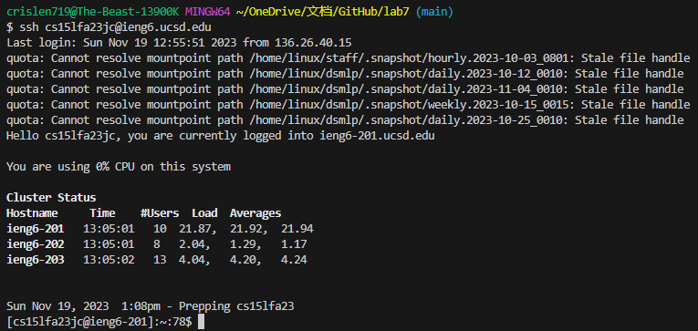
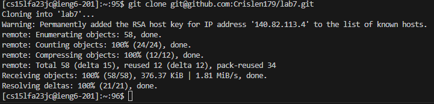
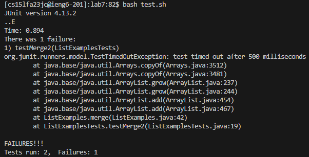
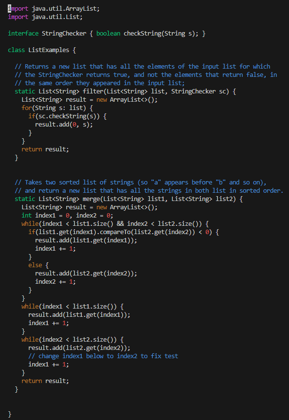
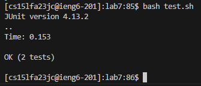
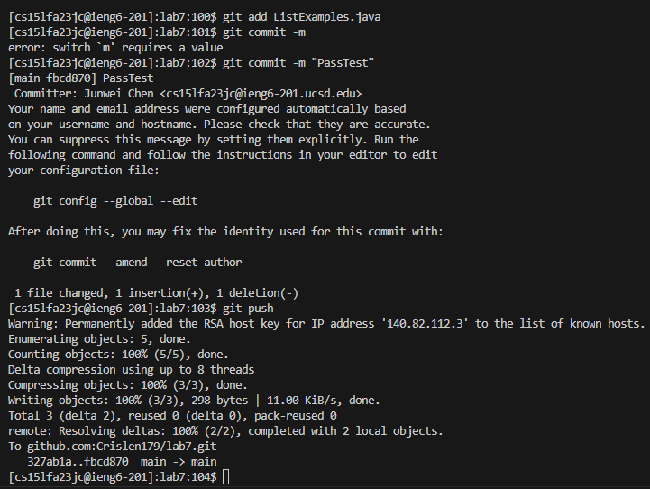

Step4: Log into ieng6
We type ssh cs15lfa23**(your own username)@ieng6.ucsd.edu to log into ieng6 remote server. The screenshot is shown below: <br />
 <br />

Step5: Clone your fork of the repository from your GitHub account <br />
After we log in to the remote server, type 
```
git clone git@github.com:Crislen179/lab7.git
```
clone my fork of the repository from my GitHub account. The screenshot is shown below:
 <br />

Step6: Run the tests, demonstarting that they fail
Type `cd lab7` command to lab7 and type `bash test.sh` to run the test. The test result is shown below in the screenshot:<br />
 <br />
From the result, we see test case `testMerge2` is fail.

Step7: Edit the code file to fix the failing test
This is where we should start using vim. Type `vim ListExamples.java` to enter the file using vim. Now, in our terminal, we can see the contant inside `ListExmaples.java` as what screenshot look like. <br />
 <br />
By looking at the code from github, we see that the code need to change is in line 43, so we type <43j> to move cursor down 43 lines from what line your are, and now we in line 1. In line 43, the line write `index1 += 1`,
and we need to change index1 to index2 to fix the test. We type <12l> to move the cursor 12 block to the right in line 43. Press <i> into
insert mode and press <x> to delete `1` in `index1`, type `2` to change `index1` to `index2`. Press <esc> to quit the insert mode.
Enter <:wq> to save the file and quit the vim.

Step8: Run the tests, demonstarting that they now succeed
Type `bash test.sh` to run the test again, the result is shown in the screenshot below:
 <br />
From the result, we can see now the test is run succeeful with no bug.

Step9: Commit and push the resulting change to your Github account
First we type `git add ListExamples.java` to mark what file we want to get push. Then we type `git commit -m "(Whatever commit you want)` to add a commit.
Finally, we type `git push ListExamples.java` to push the file to Github. The screenshot of the output is shown below:<br />
 <br />
